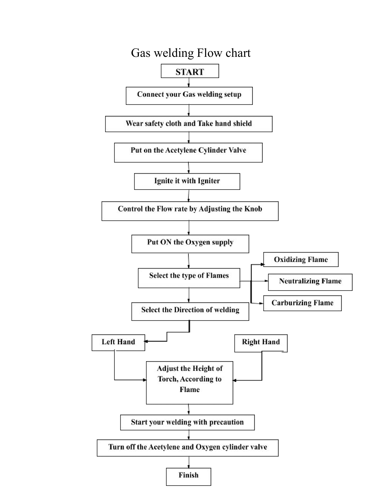
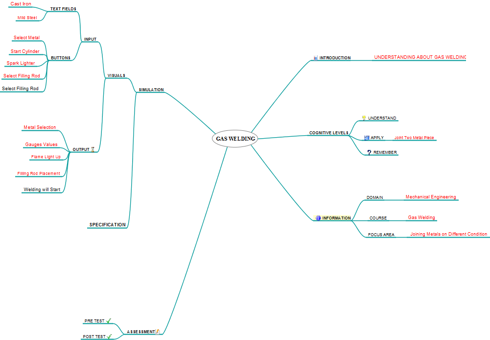
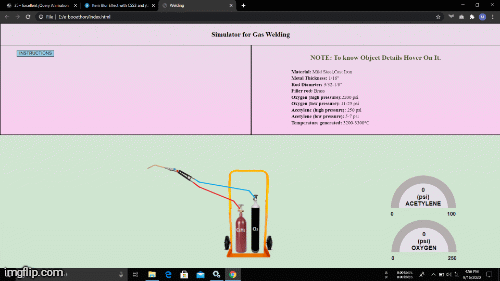

## Storyboard (Round 2)

Experiment 1: To study Gas Welding process and it’s equipment (Oxy-acetylene welding)

### 1. Story Outline:

This experiment involves permanent joining of two or more metal pieces by the means of flames at high temperature & pressure made by combination of oxygen & fuel gas (i.e. acetylene, hydrogen, etc.). The objective of this experiment is to study about gas welding and it’s equipment.

### 2. Story:

Gas welding is a fusion welding process. Its joins metals, using heat from combustion of oxygen and fuel gas such as acetylene, hydrogen, propane, etc. The intense heat from the flame melts the edges and fuses them together generally with help of filler metal,
In oxy-acetylene welding, when correct proportion of oxygen and acetylene are mixed and ignited they are hot enough to melt and fuse parent metals and at around 3200°c it is hot enough to melt all commercial metals. A filler rod is used in molten metal pool to build up seam of higher strength. There are three different types of flame
1. Neutral Flame: (acetylene & oxygen in equal portions)
The temperature of the flame is at around 3200 °c. It is commonly used for welding of mild steel, cast iron,copper,etc.
2. Oxidizing Flame: (Excess oxygen)
The temperature of the flame is around 3400 °c. It is commonly used for copper-base and zinc-base metals.
3. Reducing Flame :( Excess acetylene) 
The temperature of the flame is at around 3000°c. It is used for welding of lead,etc.
 

#### 2.1 Set the Visual Stage Description:
We divide our whole simulator into two parts. The top part comprises the instructions and specifications for the simulator and the bottom part is for simulator actions. The topmost part is further divided into two parts one for instruction and another for the specification. The instruction consists of steps that will be followed by the user to perform the simulation practical and the specification parts consist of basic information about the setup.

#### 2.2 Set User Objectives & Goals:
1. By this experiment student will be able to study and remember about gas welding and its equipment
2. The experiment describe about the welding principle and describe its application
 

#### 2.3 Set the Pathway Activities:

1. User will decide between two different metal pieces
2. The next step will appear to select the metal piece
3.After the user will click on the start cylinder button
4. Next, the spark lighter will light up the flame
5. Then the user has to select the filler rod 
6. Finally, the user clicks on the start welding button to perform the final task

##### 2.4 Set Challenges and Questions/Complexity/Variations in Questions:

1. Why is filler rod used in melt metal pool?
 A.to increase rigidity 
 B.To increase ductility
 C.To increase strength 
 D.To hardened the material
2. What is the temperature of neutral/oxidizing/reducing flame?
 A.3600/3400/3200
 B.3200/3400/3000
 C.3400/3200/3000
 D.3200/3000/3400 

##### 2.5 Allow pitfalls:
1. The simulator is designed for showing the gas welding of cast iron and mild steel only.
2. The user has to follows all the instructions step by step for learning the practical. 

##### 2.6 Conclusion:
User will take approx. 10 mins for understanding the procedure. Then for understanding the process by simulator will take 2-3 minutes. Then 10 minutes to take 10 mins for quiz. Hence total time taken for doing experiment will be approx. 22-25 minutes.

##### 2.7 Equations/formulas: NA
The most common fuel used in welding is acetylene. It has a two stage reaction; the first stage primary reaction involves the acetylene disassociating in the presence of oxygen to produce heat, carbon monoxide, and hydrogen gas.
 2C2H2 + 2O2 = 4CO + 2H2 + Heat ---------- (1)
 A secondary reaction follows where the carbon monoxide and hydrogen combine with more oxygen to produce carbon dioxide and water vapor.
 4CO + 2H2 + 3O2 = 4CO2 + 2H2O + Heat--------- (2)
 When you combine equations (1) and (2) you will notice that about 5 parts of oxygen is necessary to consume 2 parts of acetylene
 2C2H2 + 5O2 = 4CO2 + 2H2O + Heat ----------- (3) 
Or we can say about 2.5 parts of oxygen is necessary to achieve complete combustion of acetylene. In operation, one part of oxygen is supplied through the torch and the remaining 1.5 parts is obtained from the surrounding air atmosphere (secondary reaction). When the secondary reaction does not burn all of the reactants from the primary reaction, the welding processes produces large amounts of carbon monoxide, and it often does. Because of the need for supplemental oxygen from the atmosphere, the acetylene oxygen flame cannot be used inside of pipes or structures subjected to oxygen depletion from gas welding. By varying the relative amounts of acetylene and oxygen, a welder can produce different flame atmospheres and temperatures as he requires.

### 3. Flowchart 4
 

### 4. Mindmap:

### 5. Storyboard :

